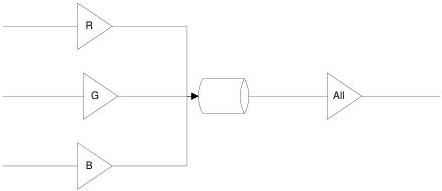

Figure 6-2: Gain All post amplification

By following this rule, the value read for the All gains remains valid even when the channel/tap gains are not all equal.

Possible values are:

- All: Gain will be applied to all channels or taps.
- Red: Gain will be applied to the red channel.
- Green: Gain will be applied to the green channel.
- Blue: Gain will be applied to the blue channel.
- Y: Gain will be applied to Y channel.
- U: Gain will be applied to U channel.
- V: Gain will be applied to V channel.
- Tap1: Gain will be applied to Tap 1.
- Tap2: Gain will be applied to Tap 2.
- ...
- AnalogAll: Gain will be applied to all analog channels or taps.
- AnalogRed: Gain will be applied to the red analog channel.
- AnalogGreen: Gain will be applied to the green analog channel.
- AnalogBlue: Gain will be applied to the blue analog channel.
- AnalogY: Gain will be applied to Y analog channel.
- AnalogU: Gain will be applied to U analog channel.
- AnalogV: Gain will be applied to V analog channel.
- AnalogTap1: Analog gain will be applied to Tap 1.