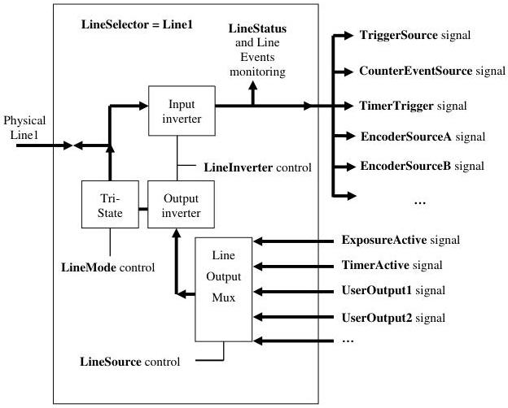

|  GEN<i>CAM |   | emva  |
| --- | --- | --- |
|  Version 2.7.1 | Standard Features Naming Convention  |   |

## 9 Digital I/O Control

The Digital I/O chapter covers the features required to control the general Input and Output signals of the device. This includes input and output control signals for Triggers Timers, counters and also static signals such as user configurable input or output bits.

### 9.1 Digital I/O usage model

The Digital I/O Control model presents each I/O Line as a physical line of a device connector and that goes into or comes from an I/O Control Block permitting to condition and to monitor the incoming or outgoing signal.

Figure 9-1: I/O Control