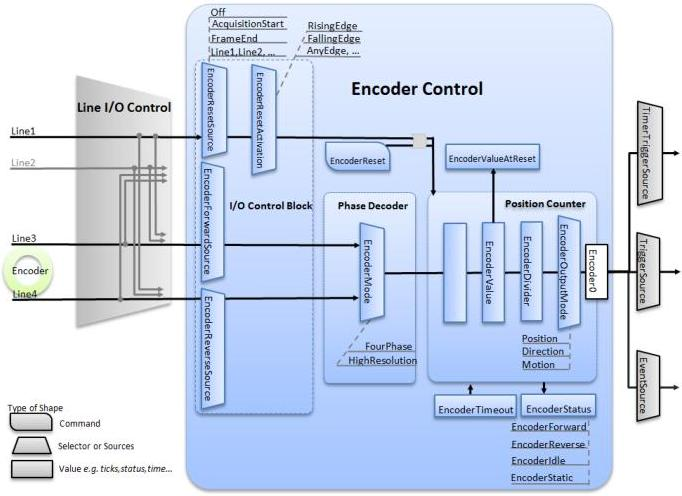

Figure 11-1: Encoder interface overview.

### Encoder Output Modes:

With a quadrature encoder connected it is possible to use the Encoder Control output to trigger the camera in several ways when the motion moves forwards and backwards. The illustration below shows 3 different Encoder Output Modes. The Position and Direction modes can both work in "up" and "down" counting directions to allow the user to select a positive or negative direction.

The **Position** mode generates output pulses on position increments only in one direction and will result in an image as if there was only forward motion even if the motion reverse for a short time. No output pulses are generated until after the position where the reversal started has passed. The position "memory" (counter resolution) must be sufficient to handle a reasonable reversal without false "reset".