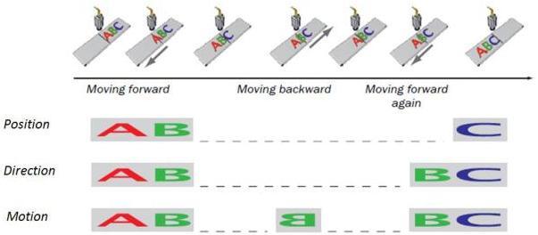

|  GEN<i>CAM |   | emva  |
| --- | --- | --- |
|  Version 2.7.1 | Standard Features Naming Convention  |   |

The **Direction** mode generates output pulses on position increments only in one direction. This mode can be used to trigger a camera in an application where the reverse motion is ignored. For a linear stage moving back and forth, output pulses will be generated only in one direction.

The **Motion** mode generates output pulses on position increments in both directions. This mode can in some implementations be achieved by connecting only one signal (A or B) from the quadrature encoder to the Encoder Control interface.

Figure 11-2: Encoder position, direction and motion output modes.

### Encoder Modes:

The encoder mode controls how the EncoderValue is calculated as function of the encoder inputs. The EncoderValue always tracks the encoder motion forward and backwards and is the input for the Encoder Output Mode functionality.

### Robust Four phases motion tracking

There are 4 possible states from the two input signals and their transitions can be viewed in a state diagram as shown below. With this strategy, a small amount of jitter between two states from the quadrature encoder will be filtered. All transitions from the 00 quadrature encoder state sets the direction state to Pos or Neg. Counter increments or decrements only occur when entering the 00 state. Increments or decrements can only occur when the direction state is positive (Pos) or negative (Neg), respectively as seen in the figure.

Note that Quadrature encoders follow the Gray Code binary numeral system where only 1-bit changes between states. Therefore, transitions where 2 bits change are illegal such as between states 01 and 10, and 00 and 11. Illegal state changes can be filtered thereby reducing jitter for both Four Phase and High Resolution modes.