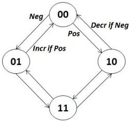
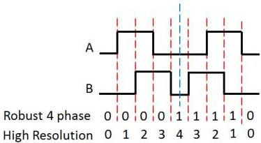

Figure 11-3: Encoder 4 states up and down counting.

### High resolution motion tracking

In some applications, a higher resolution is required, but this will be available without jitter filtering. In this case the counter can increment or decrement for each of the quadrature phases in the state diagram as illustrated below. This mode supports all Encoder Control output modes, but is not recommended in the Motion mode since jitter between two states may result in continuous output pulses.

Figure 11-4: Encoder Control interface and EncoderValue in both motion tracking modes.

### Motion Tracking Direction:

The Encoder Control interface use an A and a B EncoderSource input connected to the quadrature encoder outputs. These typically correspond to the A and B labelled outputs on the quadrature encoder. The direction of