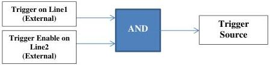

|  GEN<i>CAM |   | emva  |
| --- | --- | --- |
|  Version 2.7.1 | Standard Features Naming Convention  |   |

## 12 Logic Block Control

The Logic Block Control chapter describes the model and features related to the control and the generation of signals by Logic Block elements.

A Logic Block is a general combinational logic element that preforms a binary function on its inputs and can be used to condition various signal sources (internal or external). It generates an output signal according to the combinational binary equation selected. This Logic Block generates an output signal which can then be used as input source for other SFNC modules (Trigger, Timer, Counter, ...) using the names LogicBlock0, LogicBlock1, ...

A typical usage scenario could be a user that wants to control when a trigger is considered valid using external input Lines and an internal camera signal (See Example 2 below).

### 12.1 Logic Block usage model

#### Example 1

Setting of an AND logical block to start the grab if a trigger pulse is received on Line1 (Trigger) and Line 2 (Trigger Enable) is Low:

/* Initialize the AND Logic Block input sources. */
LogicBlockSelector = LogicBlock0;
LogicBlockFunction[LogicBlock0] = AND;
LogicBlockInputNumber[LogicBlock0] = 2;
LogicBlockInputSelector[LogicBlock0] = 0;
LogicBlockInputSource[LogicBlock0][0] = Line1;
LogicBlockInputSelector[LogicBlock0] = 1;
LogicBlockInputSource[LogicBlock0][1] = Line2;

/* Set the AND Logic Block output as trigger source and do an acquisition. */
TriggerSelector = FrameStart;
TriggerSource = LogicBlock0;
TriggerActivation = RisingEdge;
TriggerMode = On;
AquisitionStart();
...
AquisitionEnd();