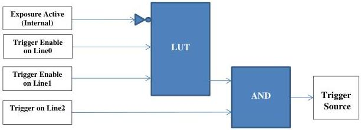

## Example 2

Setting of a custom 3 inputs LUT cascaded in an AND Logic block. The LUT is cascaded in the AND Logic block to enable the trigger only if a user defined condition is meet.

The final combination would give a condition where if Exposure is not active in the camera and either Line0 or Line1 is high, a rising edge trigger on Line2 will trigger a new frame.

|   |   |   | LUT Output  |
| --- | --- | --- | --- |
|  2 | 1 | 0  |   |
|  0 | 0 | 0 | 0  |
|  0 | 0 | 1 | 0  |
|  0 | 1 | 0 | 0  |
|  0 | 1 | 1 | 1  |
|  1 | 0 | 0 | 0  |
|  1 | 0 | 1 | 1  |
|  1 | 1 | 0 | 0  |
|  1 | 1 | 1 | 1  |

/* Initialize the LUT Logic Block input sources and output. */
LogicBlockSelector = LogicBlock0;
LogicBlockFunction[LogicBlock0] = LUT;
LogicBlockInputNumber[LogicBlock0] = 3;
LogicBlockLUTInputSelector[LogicBlock0] = 0;
LogicBlockLUTInputSource[LogicBlock0][0] = ExposureActive;
LogicBlockInputInverter[LogicBlock0][0] = True;
LogicBlockLUTInputSelector[LogicBlock0] = 1;
LogicBlockLUTInputSource[LogicBlock0][1] = Line0;
LogicBlockInputInverter[LogicBlock0][1] = False;
LogicBlockLUTInputSelector[LogicBlock0] = 2;
LogicBlockLUTInputSource[LogicBlock0][2] = Line1;