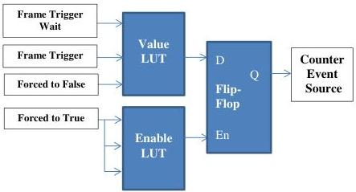

|  GEN<i>CAM |   | emva  |
| --- | --- | --- |
|  Version 2.7.1 | Standard Features Naming Convention  |   |

LogicBlockInputInverter[LogicBlock0][2] = False;
LogicBlockLUTValueAll[LogicBlock0] = 0xA8;

/* Initialize the AND Logic Block input sources. */
LogicBlockSelector = LogicBlock1;
LogicBlockFunction[LogicBlock1] = AND;
LogicBlockInputNumber[LogicBlock1] = 2;
LogicBlockInputSelector[LogicBlock1] = 0;
LogicBlockInputSource[LogicBlock1][0] = LogicBlock0;
LogicBlockInputSelector[LogicBlock1] = 1;
LogicBlockInputSource[LogicBlock1][1] = Line2;

/* Set the cascaded Logic Blocks as the trigger source and start the acquisition. */
TriggerSelector = FrameStart;
TriggerSource[FrameStart] = LogicBlock1;
TriggerActivation[FrameStart] = RisingEdge;
TriggerMode[FrameStart] = On;
AquisitionStart();
...
AquisitionEnd();

### Example 3

Setting of a custom Latched dual LUTs Logical Block counting the number of triggers that occur when FrameTriggerWait is not active (i.e. Over trigger counting).

|  Input |   |   | Value LUT Output  |
| --- | --- | --- | --- |
|  2 | 1 | 0  |   |
|  0 | 0 | 0 | 0  |
|  0 | 0 | 1 | 0  |
|  0 | 1 | 0 | 0  |
|  0 | 1 | 1 | 1  |

|  Input |   |   | Enable LUT Output  |
| --- | --- | --- | --- |
|  2 | 1 | 0  |   |
|  1 | 0 | 0 | 1  |
|  1 | 0 | 1 | 1  |
|  1 | 1 | 0 | 1  |
|  1 | 1 | 1 | 1  |

|  Input |   | Q Next Output  |
| --- | --- | --- |
|  D | En |   |
|  0 | 0 | Q Previous  |
|  0 | 1 | 0  |
|  1 | 0 | Q previous  |
|  1 | 1 | 1  |