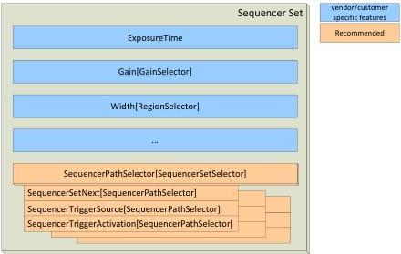

|  GEN<i>CAM |   | emva  |
| --- | --- | --- |
|  Version 2.7.1 | Standard Features Naming Convention  |   |

The trigger is defined by the features

SequencerTriggerSource[SequencerSetSelector][SequencerPathSelector] and

SequencerTriggerActivation[SequencerSetSelector][SequencerPathSelector]. The functions of these features are the same as TriggerSource and TriggerActivation. For a flexible sequencer implementation, the SequencerPathSelector[SequencerSetSelector] should be part of the sequencer sets.

A sequencer set should contain the following values:

- Camera data which should be controlled by the device
- SequencerPathSelector[SequencerSetSelector] with at least one path
- SequencerSetNext, SequencerTriggerSource and SequencerTriggerActivation for every path which is selectable by the SequencerPathSelector.

An example of a sequencer set is shown in the following figure:

## Operation of a sequencer

The sequencer is started or stopped using the feature SequencerMode. If the sequencer is switched on, the start set which is defined by SequencerSetStart is loaded. The SequencerStartSet can take the same values as SequencerSetSelector.

While the sequencer is running, the SequencerSetActive is updated each time a new set is loaded. The feature can be used to read the current set – and the user might monitor the sequencer triggers.

If a trigger, which is selected by SequencerTriggerSource[SequencerSetSelector][SequencerPathSelector] and SequencerTriggerActivation[SequencerSetSelector][SequencerPathSelector] occurs, the sequencer switches to the next set. This set is configured by SequencerSetNext[SequencerSetSelector][SequencerPathSelector], which is also part of a special sequencer path. If there is more than one path selected, the sequencer switches to the set whose trigger primarily occurred.