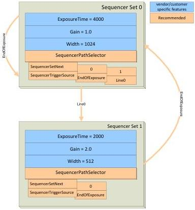

### Example 2: Complex changes to features with multiples selectors.

In this example, the camera has 4 configurable sets. Set 0 and Set 1 are the main sets for the device to capture images. The only parameters within the sequencer sets are **Exposure Time**, **Gain** and the **SequencerPathSelector** and therefore **SequencerSetNext**, **SequencerTriggerSource**.

After the camera has captured an image with Set 0 the sequencer switches to Set 1. Then after the camera has captured another image with Set 1, the sequencer switches back to Set 0. So the most time the sequencer is alternating between Set 0 and Set 1. But 2 timers with different run times are also used to activate Set 2 and Set 3 when required.

The parameters of the individual sets are:

- **Set 0:**

- ExposureTime = 4000
- Gain = 1.0
- SequencerSetNext[0] = 1
- SequencerTriggerSource[0] = ExposureEnd
- SequencerSetNext[1] = 3

- SequencerTriggerSource[1] = Timer0End

**Set 1:**