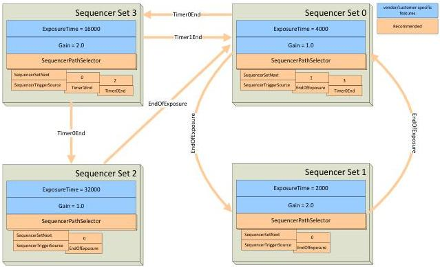

|  GEN<i>CAM |   | emva  |
| --- | --- | --- |
|  Version 2.7.1 | Standard Features Naming Convention  |   |

- ExposureTime = 2000
- Gain = 2.0
- SequencerSetNext[0] = 0

- SequencerTriggerSource[0] = ExposureEnd

### Set 2:

- ExposureTime = 32000
- Gain = 1.0
- SequencerSetNext[0] = 0

- SequencerTriggerSource[0] = ExposureEnd

### Set 3:

- ExposureTime = 16000
- Gain = 2.0
- SequencerSetNext[0] = 0
- SequencerTriggerSource[0] = Timer1End
- SequencerSetNext[1] = 2
- SequencerTriggerSource[1] = Timer0End

The working diagram is shown in the following figure:

