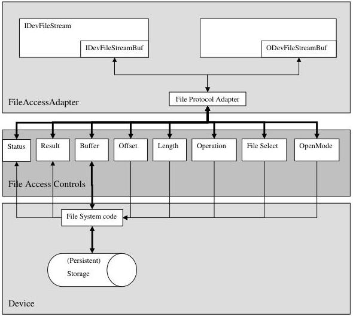

## 18 File Access Control

The File Access Controls chapter describes all features related to accessing files in the device.

It contains the definition of a generic file access schema for GenICam compliant devices. It is based on a set of standard features that are controlled from adapter code which resides in the GenICam reference implementation. The adapter code presents its services through an interface inherited from std::iostream.

The model, on which the controls are based, is depicted in the following diagram:

Figure 18-1: File Access Model

It assumes that all operations, which can be done on the persistent storage, could be executed by using operations with the semantic of fopen/fclose/fread/fwrite. The operations and their parameters are mapped onto the features of the list of File Access Controls.