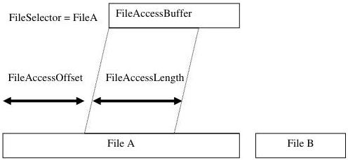

|  GEN<i>CAM |   | emva  |
| --- | --- | --- |
|  Version 2.7.1 | Standard Features Naming Convention  |   |

## File Access Control:

The **FileSelector** feature selects the target file in the device for the Operation. The entries of this enumeration define the names of all files in the device that can be accessed via the File Access.

**FileOperationSelector** specifies the operation to execute on the file.

**FileOperationExecute** command starts the selected operation execution.

**FileOpenMode** is a parameter for the Open operation and controls the access mode (Read, Write, ReadWrite) in which the file is opened.

**FileOperationStatus** returns the status of the last operation executed on the file. This feature must return Success if the operation is executed as requested.

**FileOperationResult** returns the number of bytes successfully read/written bytes during the previous Read or Write operations.

**FileSize** returns the size of the file in bytes.

The data, that is read from or written to the device, is exchanged between the application and the device through the **FileAccessBuffer** feature. This register mapped **FileAccessBuffer** must be written with the target data before executing the Write operation using **FileOperationExecute**. For Read operation, the data can be read from the **FileAccessBuffer** after the Read operation has been executed.

**FileAccessOffset** controls the starting position of the access in the file.

**FileAccessLength** controls the number of bytes to transfer to or from the **FileAccessBuffer** during the following Read or Write operation.

Altogether, the features **FileSelector**, **FileAccessOffset** and **FileAccessLength** control the mapping between the device file storage and the **FileAccessBuffer**.

Figure 18-2: Layout of File Access Buffer.