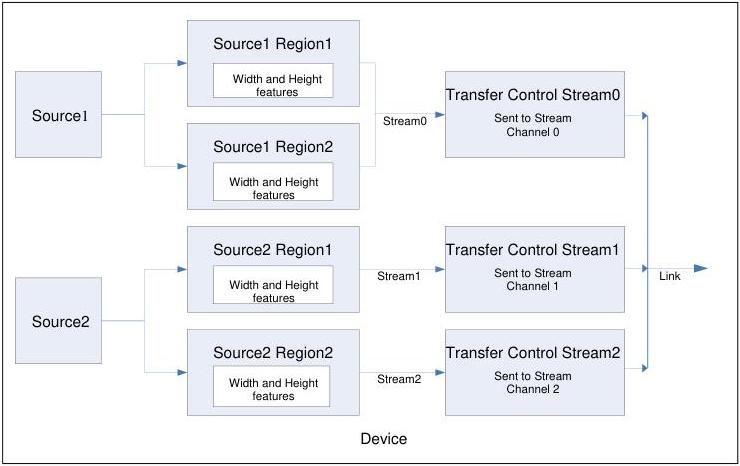

|  GEN<i>CAM |   | emva  |
| --- | --- | --- |
|  Version 2.7.1 | Standard Features Naming Convention  |   |

## 19 Source Control

The Source Control chapter describes the features related to multi-source acquisition devices. An example of such a multi-source device would be a camera with 2 independent sensors (visible and infra red light) that would transmit their data on a single camera's physical connector but would have independent controllable features.

### 19.1 Source Control usage model with Multiple Regions and Transfers

This section explains the general model for control of the acquisition on multi-source devices.

The section also presents the relation of the sources with other elements such as the region of interest and the data transfer control module that can be found in more sophisticated multi-source devices.

Figure 19-1: Multi-Source multi-Region Device with data stream Transfer control.