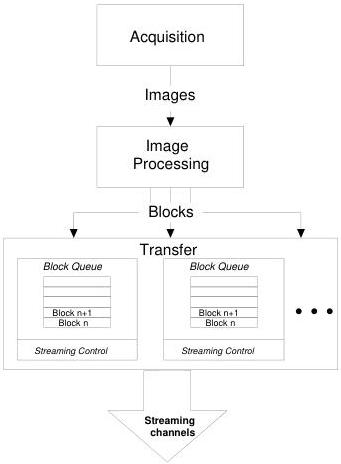

|  GEN<i>CAM |   | emva  |
| --- | --- | --- |
|  Version 2.7.1 | Standard Features Naming Convention  |   |

## 20.1 Transfer Control Model

The Transfer Control Model section describes the features related to the transfer of data by the device. It describes the basic Transfer model and the typical behavior of the device when sending data to the outside.

An acquisition typically generates images (or frames). Those images can be preprocessed (Ex: Bayer conversion) before transferring them out by the Device. In certain cases, those images can also be transformed in other type of data (such as an intensity histogram) by an internal image processing module. So it is possible that in addition to the original image acquired, a transformed image or some related data also needs to be transferred out of the device. In the following model, it is considered that the captured images are transformed into different data blocks by an optional image processing module. Those data blocks are then sent to a transfer module on different data streams. The Transfer module will then transmit those data blocks externally on one or many streaming channels. This typical acquisition data flow is represented here:

Figure 20-1: Acquisition and Transfer data flow.