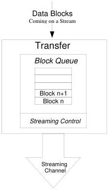

|  GEN<i>CAM |   | emva  |
| --- | --- | --- |
|  Version 2.7.1 | Standard Features Naming Convention  |   |

In summary, a transfer is the action of streaming data blocks to another device. Data blocks are complex data structures that can represent images, image processing results or even files. The transfer module is composed of one or many block Queue(s) and Streaming Controls section(s).

Figure 20-2: Transfer control section.

### Block Queue

A Block Queue is used to store data blocks for the time interval between its generation and its transmission.

### Streaming Control

The streaming control regulates the outgoing flow of data. The streaming can be in one of the following states: Stopped, Stopping, Streaming and Paused. The transfer module always accepts the new blocks of data from the image processing module regardless of the streaming state. The transfer control features TransferStart, TransferStop, TransferAbort, TransferPause and TransferResume allow the user to change the state of the streaming.