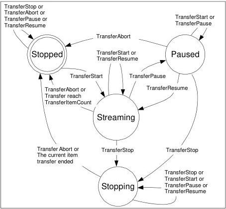

Figure 20-3: Transfer control state.

Streaming: Data blocks will be transmitted when enough data is available.

Stopping: Data blocks transmission is stopping. The current block transmission will be completed and the transfer state will change to Stopped.

Stopped: Data blocks transmission is stopped.

Paused: Data blocks transmission is suspended immediately.