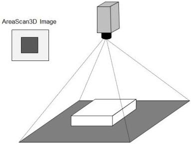

## 21 3D Scan Control

The 3D scan Control chapter describes the model and features related to the control and acquisition of 3D images.

3D cameras measure geometrical information rather than intensity or color. Typically a 3D camera delivers a range (also called depth or distance) image. In the same way as there are Areascan and Linescan 2D cameras we have many instances of Areascan and Linescan 3D devices.

In general, 3D data needs more auxiliary information than 2D data to interpret the data. Such information is for instance coordinate system used and its location, units used etc. It is recommended to provide chunk data with this information in the image streams to facilitate the acquisition engine understanding the data.

### Areascan 3D

Areascan 3D cameras can give a range image of a static scene, typically without any visible motion of the camera.

Areascan 3D cameras typically acquire a complete 3D range map or point cloud in a single shot. Examples are stereo cameras, time-of-flight cameras and the fixed-pattern triangulation cameras. Other Areascan 3D cameras use multiple exposures with different illumination or acquisition locations and use reconstruction methods based on e.g. triangulation, depth-from-focus or shape from shading.

Typically the output can be viewed as an image where intensity or color represents range. This type of single view-point image is technically called a 2.5D range image. For example, for each sensor (image) coordinate only one Z, or range coordinate, is possible.

Figure 21-1: 3D Areascan camera.