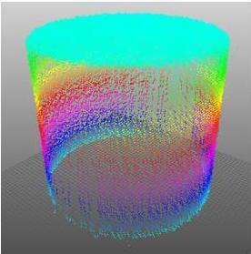

|  GEN<i>CAM |   | emva  |
| --- | --- | --- |
|  Version 2.7.1 | Standard Features Naming Convention  |   |

## Point Clouds

Through calibration procedures one or more 2.5D range images can be converted to a 3D point cloud. In a 3D point cloud multiple Z values are possible for each X and Y coordinate. Typically such a point cloud is organized, i.e. it can be represented as 3 separate images, and neighbouring pixels typically are neighbours also in 3D space. However, even in an organized point cloud it is not guaranteed that neighbouring pixel positions represents neighbouring points in the 3D world.

In general we do not distinguish between cameras delivering a 2.5D range map and 3D point cloud data in this document.

Figure 21-2: 3D point cloud data set representing a cylinder.

## Linescan 3D

Linescan 3D devices acquire a contour of the target in each acquisition and typically use linear object or camera motion to image complete 3D objects. The final result is typically 3D images of objects in the same sense as for Areascan 3D cameras, but the Y (scan) direction size may be variable and the coordinate values increase/decrease continuously with the motion.

Linescan 3D devices include laser plane triangulation (sheet-of-light) and time-of-flight laser scanners with 1D scanning. There are also stereo linescan cameras.

For the typical Linescan 3D camera the distance between scans is fixed, with the camera triggered from a motion sensing device such as an encoder. In this case the scale information for this coordinate can be expressed via the Scan3dCoordinateScale feature which is part of the Scan3dControl category.

It is also common with fixed acquisition time to use an encoder value to indicate the sampling position. Chunk data can then be used to mark each scan line with the encoder counter, and together with a scale factor for the counter, it is possible to reconstruct the position for the data along the motion direction.