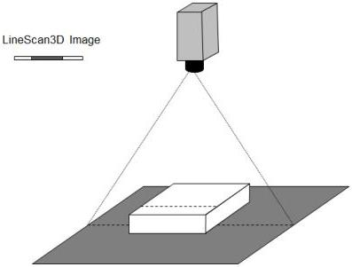

|  GEN<i>CAM |   | emva  |
| --- | --- | --- |
|  Version 2.7.1 | Standard Features Naming Convention  |   |

Figure 21-3: 3D Linescan camera.

## Invalid Data

A 3D camera typically delivers data formatted as images representing distance. Due to occlusion and object reflectance properties all points in such a 3D image typically do not hold valid measurements. This is generally called invalid or missing data and care must be taken when processing 3D images which contain such data.

To efficiently handle invalid data the 3D extension includes a Confidence (mask) image concept to mark valid pixels. The concept allows a weighted confidence as well as a binary valid /non-valid. As an alternative to mask images it is possible to define a certain (out-of-bounds) value of the range data which indicates invalid data. It is common to use e.g. 0 or a high value outside the valid range of actual measurement to indicate invalid data. The use of NaN as invalid is discouraged due to possible processing overhead.