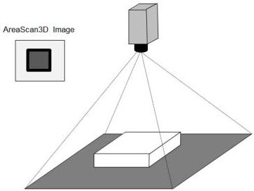

Figure 21-4: 3D invalid or missing data due to occlusion around the box (in black).

### 21.13D Scan usage model and configuration scenarios

This section illustrates few possible 3D system setups and how sensors, regions, data formatting and coordinate systems can be defined. The SFNC and PFNC definitions are used in pseudo code examples covering the main setup points. Note that due to naming restriction in some programming language, the 3D control features use the prefix Scan3d instead of 3dScan.

### Default 3D configuration:

The default configuration uses Cartesian coordinates with mm units in the Anchored coordinate system. In the examples below the features Scan3dCoordinateSystem, Scan3dDistanceUnit and Scan3dCoordinateSystemReference are not used unless a value different from the default is used.

Also, for the default basic 3D system examples, only a single sensor with a single region is used (i.e. No SourceSelector or RegionSelector used). For more detailed examples see the chapter 21.3 (3D Device data output control).

### Multi-source:

The SFNC standard covers cameras with multiple sources using the SourceControl and the SourceSelector concept. This is aimed at cameras with multiple physical sensors such as color and IR, but can also be used with a single physical sensor exposing multiple virtual sensors (sources). This is applicable for advanced 3D cameras. Multiple sources can be used when the camera has multiple physical sources that deliver data, as in a