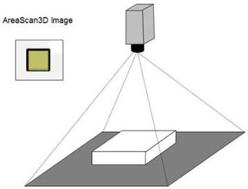

|  GEN<i>CAM |   | emva  |
| --- | --- | --- |
|  Version 2.7.1 | Standard Features Naming Convention  |   |

stereo camera, or when different regions on a physical sensor have different 3D coordinate systems as illustrated in some of the use cases below.

### 21.1.1 3D acquisition devices configuration examples

# **Basic Areascan 3D camera:**

This example shows the setup for a basic 3D camera acquiring uncalibrated range maps from a sensor, and reading the min/max range of the resulting data.

Figure 21-5: 3D Areascan camera Range acquisition.

// Basic Areascan 3D camera.
// ***

// 3D output as range map (16 bit integers),
// Setup acquisition position and size (full sensor).
OffsetX = 0;
OffsetY = 0;
Width = 2048;
Height = 2048;

// Setup output Image Component and Pixel Format.
ComponentSelector = Range;
ComponentEnable[Range] = True;
PixelFormat[Range] = Coord3D_C16;

// Scan3D setup of coordinate system information (Uncalibrated Range Map (2.5D) output).
Scan3dOutputMode = UncalibratedC;