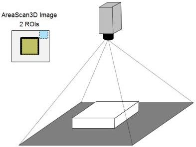

|  GEN<i>CAM |   | emva  |
| --- | --- | --- |
|  Version 2.7.1 | Standard Features Naming Convention  |   |

// Get dynamic range information in that output mode.
Scan3dCoordinateSelector = CoordinateC;
minRangeValue = Scan3dAxisMin[CoordinateC]; // e.g. 1
maxRangeValue = Scan3dAxisMax[CoordinateC]; // e.g. 4095

This 3D data can be transmitted without multi-component transfer, and this would also be possible if the result was a full point cloud transmitted in one of the "ABC" formats.

### Areascan 3D camera with Regions:

This type of camera could be for example a time-of-flight array camera, or any other device delivering a 3D range image for each exposure of its unique sensor.

Figure 21-6: 3D areascan camera Range acquisition with multiples Regions.

The main part of the 3D setup in this case could be:

// Areascan 3D camera with 2 Regions.
// ***
// Scan3D Control setup of coordinate system information.
// 3D point cloud out in sensor pixel grid organization.
//
// Note: In this example use both Regions output data in the same coordinate system.
// No Scan3dExtractionSelector or Scan3dExtraction regions are therefore needed.
// In a more general case usage of RegionX -> Scan3dExtractionY can overcome this.
Scan3dOutputMode = CalibratedABC_Grid;
Scan3dDistanceUnit = Inch; // Set non-default value.