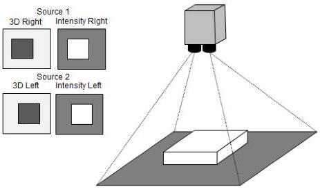

|  GEN<i>CAM |   | emva  |
| --- | --- | --- |
|  Version 2.7.1 | Standard Features Naming Convention  |   |

Scan3dCoordinateTransformSelector = TranslationZ;

Scan3dTransformValue[TranslationZ] = 403;

// Read the resulting transformed origin & pose relative to Reference position.

Scan3dCoordinateReferenceSelector = TranslationX;
originX = Scan3dCoordinateReferenceValue[TranslationX];
Scan3dCoordinateReferenceSelector = TranslationY;
originY = Scan3dCoordinateReferenceValue[TranslationY];
Scan3dCoordinateReferenceSelector = TranslationZ;
originZ = Scan3dCoordinateReferenceValue[TranslationZ];
Scan3dCoordinateReferenceSelector = RotationX;
poseX = Scan3dCoordinateReferenceValue[RotationX];
Scan3dCoordinateReferenceSelector = RotationY;
poseY = Scan3dCoordinateReferenceValue[RotationY];
Scan3dCoordinateReferenceSelector = RotationZ;
poseZ = Scan3dCoordinateReferenceValue[RotationZ];

### Stereo 3D Camera with Regions and Sources:

In a stereo system there are (at least) two image sensors. Typically one of them is the "master" and the disparity (lateral matching pixel position difference, which is approximately inversely proportional to range) between this and the other is measured and output. It is also possible to be able to switch which sensor is master, or even create a virtual centered 3rd sensor view.

Here it is natural to view the system as having multiple sources, where each source potentially has its own 3D setup.

Figure 21-7: Stereo cameras generating individual 3D and intensity images for each sensors.

The main part of the 3D setup is:

// 3D scan with Stereo Camera.