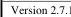

|  CAN |   |  emva  |
| --- | --- | --- |
|  Version 2.7.1 | Standard Features Naming Convention  |   |

// ***

// Output Disparity map & Intensity from a 2 sensors device.

// The 2 sensors features can be controlled using SourceSelector = Source1 or Source2.

// Using Source1 here to get the combined resulting disparity out.

// No explicit Region selector is used in the example.

SourceSelector = Source1;

// Setup 3D formatting, uncalibrated 2.5D disparity-coded range map output.

// Disparity has e.g. 0.25 (pixel) resolution and an offset 50 (pixels).

Scan3dOutputMode[Source1] = Disparity; // This can change Pixel Format, so set before query.

OffsetX[Source1] = 0;

OffsetY[Source1] = 0;

Width[Source1] = 2048;

Height[Source1] = 1024;

// Setup acquisition for selected sensor

ComponentSelector[Source1] = Disparity; // Disparity

ComponentEnable[Source1][Disparity] = True;

PixelFormat[Source1][Disparity] = Coord3D_C16; // 3D disparity output format.

ComponentSelector[Source1] = Confidence; //Confidence

ComponentEnable[Source1][Confidence] = True;

PixelFormat[Source1][Confidence] = Confidence8;

ComponentSelector[Source1] = Intensity; // Intensity

ComponentEnable[Source1][Intensity] = True;

PixelFormat[Source1][Intensity] = Mono8 // 2D Sensor 1 output.

// Get Disparity informations.

Scan3dCoordinateSelector[Source1] = CoordinateC; // Coordinate C -> Disparity.

scaleC = Scan3dCoordinateScale[Source1][CoordinateC]; // e.g. 0.25

offsetC = Scan3dCoordinateOffset[Source1][CoordinateC]; // e.g. 50

invalidFlagC = Scan3dInvalidDataFlag[Source1][CoordinateC]; // Invalid flag state.

invalidValueC = Scan3dInvalidDataValue[Source1][CoordinateC]; // e.g. 0

bboxMinC = Scan3dAxisMin[Source1][CoordinateC]; // e.g. 1

bboxMaxC = Scan3dAxisMax[Source1][CoordinateC]; // e.g. = 200

The data output could in this case, and with the second sensor setup as the first (not shown) could be formatted as:

|  Component | Part | Source | Region | data type | data format  |
| --- | --- | --- | --- | --- | --- |
|  Disparity | 0 | 1 | Region 0 | 3D disparity image | Coord3D_C16  |
|  Confidence | 1 | 1 | Region 0 | 3D confidence image | Confidence8  |
|  Intensity | 2 | 1 | Region 0 | 2D image | Mono8  |
|  Disparity | 3 | 2 | Region 0 | 3D disparity image | Coord3D_C16  |
|  Confidence | 4 | 2 | Region 0 | 3D confidence image | Confidence8  |