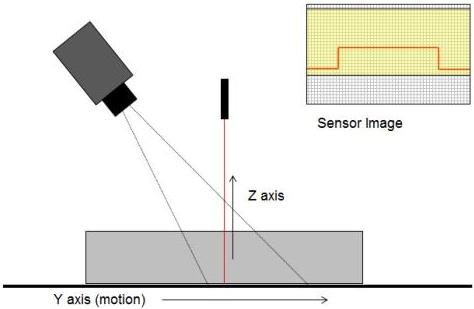

|  GEN<i>CAM |   | emva  |
| --- | --- | --- |
|  Version 2.7.1 | Standard Features Naming Convention  |   |

### Linescan 3D camera:

The typical setup for a linescan laser triangulation setup is shown below.

Figure 21-8: Laser linescan triangulation sensor with vertical laser.

An example of how the main part of the 3D setup for a laser triangulation with a vertical laser, extracting 3D, reflectance and laser scatter information, and having fixed sampling interval between scan lines could look like in this case is:

// Linescan 3D Camera examples.
// ***

// Range, Reflectance and laser Scatter is acquired (all pixel mapped).
// Setup 3D formatting, 1D rectified 2.5D range map.
// Basic device with no RegionSelector.
// Coordinate system is Cartesian, rectification gives A/B scale/offset.
Scan3dOutputMode = RectifiedC;

// Setup sensor acquisition Region.
RegionSelector = Region0;
Width[Region0] = 2000;
Height[Region0] = 1000;
OffsetX[Region0] = 0;
OffsetY[Region0] = 50;

// Setup 3D scan output region (different output size).
RegionSelector = Scan3dExtraction0;
Width[Scan3dExtraction0] = 2000;
Height[Scan3dExtraction0] = 2000;
OffsetX[Scan3dExtraction0] = 0;