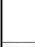

|  CAN |   |  emva  |
| --- | --- | --- |
|  Version 2.7.1 | Standard Features Naming Convention  |   |

ChunkEnable[ChunkSelector] = True;

// Reading chunk data from received buffer
ChunkScan3dCoordinateSelector = CoordinateA; // CoordinateA -> X
scaleA = ChunkScan3dCoordinateScale[CoordinateA]; // e.g. 0.5
offsetA = ChunkScan3dCoordinateOffset[CoordinateA]; // e.g. -500

// Coordinate B given by encoder mark in Chunk data, still scaled & offset as normal.
ChunkScan3dCoordinateSelector = CoordinateB;    // CS = CoordinateB -> Y
scaleB = ChunkScan3dCoordinateScale [CoordinateB]; // Scale of Encoder step.
offsetB = ChunkScan3dCoordinateOffset[CoordinateB]; // offset for this image along belt.
for (row = 0; row < Nrows; row++)
{
    ChunkScanLineSelector = row;
    // Note: Here encoder wrap-around handling is not illustrated.
    coordB[row] = ChunkEncoderValue[ChunkScanLineSelector] * scaleB + offsetB;
}
ChunkScan3dCoordinateSelector = CoordinateC;    // CoordinateC -> Z
scaleC = ChunkScan3dCoordinateScale[CoordinateC];    // e.g. 0.1
offsetC = ChunkScan3dCoordinateOffset[CoordinateC]; // e.g. 0

The data output could in this case be formatted as:

|  Component | Part | Source | Region | data type | data format  |
| --- | --- | --- | --- | --- | --- |
|  Range | 0 | 1 | Scan3dExtraction 0 | 3D plane of tri planar image | Coord3D_C16  |
|  Reflectance | 1 | 1 | Scan3dExtraction 0 | 3D plane of tri planar image | Mono8  |
|  Scatter | 2 | 1 | Scan3dExtraction 0 | 2D image | Mono16  |
|  Chunk data | (3) | - | All components chunk data if enabled (not shown). | (Chunk data) | GenICam Chunk  |