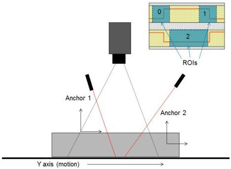

|  GEN<i>CAM |   | emva  |
| --- | --- | --- |
|  Version 2.7.1 | Standard Features Naming Convention  |   |

### Linescan 3D camera with multiple regions and coordinate systems:

With a line-scan camera using laser triangulation and multiple lasers the setup could look as in this example, where different regions are setup with different processing modules and coordinate system details such as scale and anchor position.

Figure 21-9: Laser linescan triangulation with multiple Regions and coordinate systems.

An example of how the main part of the 3D laser triangulation setup for the 3 regions of the sensors could look like:

// Linescan 3D Camera of Regions with different coordinate outputs.
// ***

// 1. Dataflow: Region0 -> Scan3dExtraction0 -> Stream0
// ---

// 1.a. Setup Sensor Region output.
RegionSelector = Region0;
RegionMode[Region0] = On; // Transmit Sensor Region.
Height[Region0] = 256; // Number of rows on sensor.
Width[Region0] = 100; // Number of columns on sensor.
OffsetX[Region0] = 25; // Position on sensor.
OffsetY[Region0] = 25; // Position on sensor.

// 1.b. Setup 3D Processing Module source and parameters.
Scan3dExtractionSelector = Scan3dExtraction0;
Scan3dOutputMode[Scan3dExtraction0] = CalibratedC;
Scan3dExtractionSource[Scan3dExtraction0] = Region0;
Scan3dExtractionMethod[Scan3dExtraction0] = Default;