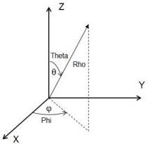
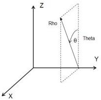

|  GEN<i>CAM |   | emva  |
| --- | --- | --- |
|  Version 2.7.1 | Standard Features Naming Convention  |   |

### 21.2.1 Coordinate systems

The defined coordinate systems are right-hand oriented Cartesian (X,Y,Z), Spherical (Theta, Phi, Rho) and Cylindrical (Theta, Y,Rho). Rho is used throughout as coordinate and pixel plane for spherical and cylindrical "Radius" coordinate. The spherical coordinate system with Phi as azimuth, angle from X axis, and Theta as polar angle from Z axis, is used in SFNC. This is referred to as the physics system. The nominal "distance" coordinate is always the 3rd coordinate, Z or Rho.

To avoid naming conflicts the 3 coordinates are named A, B and C when representing a generic 3D coordinate system, with C as the “distance” coordinate. In some cases, like coordinate system transformation, only use of Cartesian coordinates is defined, and then X, Y, Z are used.

Figure 21-10: Relationship between Cartesian and Spherical coordinate systems.

Figure 21-11: Relationship between Cartesian and Cylindrical coordinate systems.

### Linescan 3D:

For Linescan 3D cameras data for each measurement is typically in the (X, Z) plane, and the motion direction is Y. This can then be transmitted as 2-component images (Coordinates A and C) with the 3rd coordinate (B) given by a common motion related coordinate which can be embedded as counter or encoder chunk information.