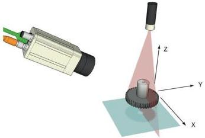

|  GEN<i>CAM |   | emva  |
| --- | --- | --- |
|  Version 2.7.1 | Standard Features Naming Convention  |   |

For a linescan3D camera with a native polar coordinate system Cylindrical 3D coordinates (Theta,Y,Rho) can be used. In some cases the measurement coordinate system is not aligned with the world coordinate system and full 3D representation for each point is needed.

Figure 21-12: Typical orientation of the axes for a Linescan3D camera.

# **Coordinate dynamic range:**

For 3D coordinates the dynamic range of the 3 coordinate axes defines a bounding box, within which all pixels are guaranteed to be. This can be used to limit the display of the data and to have suitable scaling. This is analogous with the PixelDynamicRangeMin and PixelDynamicRangeMax for intensity pixels.

The dynamic range is given in the transmitted coordinate units, i.e. before any scaling and/or offset calculation so that it reflects the actual values in the data stream.

### 21.2.2 Coordinate system position and transformation

Typically a 3D camera has a well-known pre-defined native anchor location and orientation of its measurement coordinate system. This is camera vendor specific and should if possible be defined in the camera documentation. Typical locations include the optical center of the camera, with the Z axis pointing away from the camera and a coordinate system defined to have a Z axis pointing towards the camera located to give only positive coordinates as illustrated in the figure below.

It is also recommended to place a reference point marker, with the distance (Z) pointing away from the device, on the device, and give the position and pose of the anchor system relative to this reference point in the documentation and as the anchor position/pose information in the SFNC features Scan3dCoordinateReferenceValue. A possible reference point marker is show in the figure below. With a 2D symbol the origin and orientation of 2 axes can be visualized, and by the use of a right-hand oriented system the 3rd axis orientation is then also given. Given the anchor system definition and a reference point on the device it is possible to display a received 3D image correctly as "seen from the camera" independent of the actual coordinate system used.