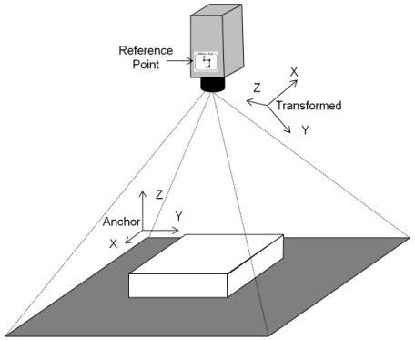

|  GEN<i>CAM |   | emva  |
| --- | --- | --- |
|  Version 2.7.1 | Standard Features Naming Convention  |   |

To facilitate merging and aligning data from multiple devices a device may support transforming from the anchored coordinate system to a transformed location and pose (orientation). The use of this transformation, and its definition, is determined with standard features described below.

The transforms are defined in Cartesian coordinates only, and therefore use the X,Y,Z notation. The transform values define the transform from Anchor to Reference and from Transformed to Reference coordinate system.

Figure 21-13: 3D camera anchors and transformed position and orientation.

### Transform Definition:

The transformation from anchor to the transformed or reference coordinate system is defined by a rotation and then a translation to the new origin.

The transforms are ThX,ThY,ThZ – rotation angles around X,Y and Z axis, and a translation T to the new origin position. Thus, 3+3 = 6 parameters define the coordinate transform.

In homogenous coordinates the transform of a point from the original coordinate system to the transformed (i.e. from Anchor to Transformed for Scan3dTransformValue and Anchor /Transformed to Reference for Scan3dReferenceValue) is defined by the transforms

$$P = \begin{pmatrix} X \\ Y \\ Z \\ 1 \end{pmatrix}$$