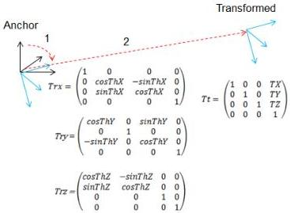

|  GEN<i>CAM |   |  emva  |
| --- | --- | --- |
|  Version 2.7.1 | Standard Features Naming Convention  |   |

\[
P ^ {\prime} = T r x * P, \qquad T r x = \left( \begin{array}{c c c c} 1 & 0 & 0 & 0 \\ 0 & \cos T h X & - \sin T h X & 0 \\ 0 & \sin T h X & \cos T h X & 0 \\ 0 & 0 & 0 & 1 \end{array} \right)
\]

\[
P ^ {\prime \prime} = T r y ^ {*} P ^ {\prime}, \quad T r y = \left( \begin{array}{c c c c} \cos T h Y & 0 & \sin T h Y & 0 \\ 0 & 1 & 0 & 0 \\ - \sin T h Y & 0 & \cos T h Y & 0 \\ 0 & 0 & 0 & 1 \end{array} \right)
\]

\[
P ^ {\prime \prime \prime} = T r z ^ {*} P ^ {\prime \prime}, \quad T r z = \left( \begin{array}{c c c c} \cos T h Z & - \sin T h Z & 0 & 0 \\ \sin T h Z & \cos T h Z & 0 & 0 \\ 0 & 0 & 1 & 0 \\ 0 & 0 & 0 & 1 \end{array} \right)
\]

and finally

\[
P ^ {\prime \prime \prime \prime} = T t * P ^ {\prime \prime \prime}, \quad T t = \left( \begin{array}{c c c c} 1 & 0 & 0 & T X \\ 0 & 1 & 0 & T Y \\ 0 & 0 & 1 & T Z \\ 0 & 0 & 0 & 1 \end{array} \right)
\]

Figure 21-14: Transformation from the anchor to the transformed system.

# Rectified Image data: