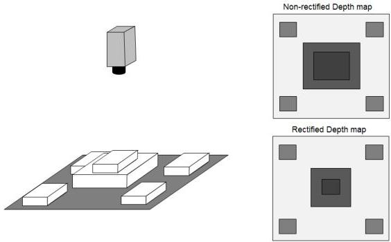

|  GEN<i>CAM |   | emva  |
| --- | --- | --- |
|  Version 2.7.1 | Standard Features Naming Convention  |   |

Calibrated 3D cameras typically generate "point-cloud" type data which does not have uniform sampling in the A-B dimension. This means that the Z, or range, image is impractical to use as a 2.5D range map with standard image processing since the apparent size of an object depends on the distance. If the point cloud is rectified to a uniform X-Y grid the Z image content will be a 2.5D range map where the apparent object size does not depend on the distance.

With rectified image data the offset to the first sample and the sample distance (scale) can be used to calculate the X and Y coordinate for any given sample in the image.

Rectified images are normally defined in Cartesian coordinates, since in other coordinate systems the apparent size of objects will be distance dependent even after rectification, but e.g. a laser scanner could have a native rectified polar coordinate system.

Figure 21-15: Rectified range maps (non-rectified range map image objects closer appear larger).