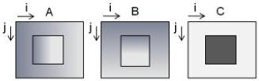
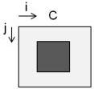
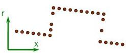
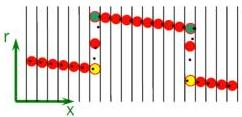

|  GEN<i>CAM |   | emva  |
| --- | --- | --- |
|  Version 2.7.1 | Standard Features Naming Convention  |   |

A(i,j)world = A(i,j)*Scan3DCoordinateScale[C_A]+Scan3DCoordinateOffset[C_A]

B(i,j)world = B(i,j)*Scan3DCoordinateScale[C_B]+Scan3DCoordinateOffset[C_B]

C(i,j)world = C(i,j)*Scan3DCoordinateScale[C_C]+Scan3DCoordinateOffset[C_C]

Figure 21-16: Range image represented as 3 image planes, A,B,C.

A(i,j)world = i*Scan3DCoordinateScale[C_A] + Scan3DCoordinateOffset[C_A]

B(i,j)world = j*Scan3DCoordinateScale[C_B] + Scan3DCoordinateOffset[C_B]

C(i,j)world = C(i,j)*Scan3DCoordinateScale[C_C]+Scan3DCoordinateOffset[C_C]

Figure 21-17: Extraction of A,B and C world coordinate information in a rectified range map image C.

Calibrated (x, r) Points

Rectified profile

Figure 21-18: Point cloud rectified to uniform X sampling interval.

(Yellow/Green shows using min/max of multiple points in a bin, red average)

### 21.2.3 Focal length and Baseline for 3D Reconstruction from Disparity

The Disparity images contain the displacement of pixels in a stereo setup. The disparity of a pixel is directly linked to the distance of the pixel. The 3D reconstruction and calculation of a point cloud from disparity images is possible using parameters like the focal length and the baseline of the stereo camera.