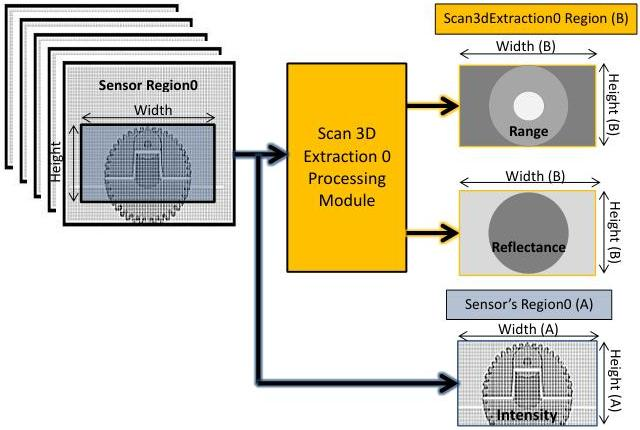

|  GEN<i>CAM |   | emva  |
| --- | --- | --- |
|  Version 2.7.1 | Standard Features Naming Convention  |   |

### 21.3 3D Device data output control

A 3D extraction device typically has its sensor's data sent to a 3D extraction processing module to calculate information such as Range, Reflectance, etc. A sensor Region can optionally be used to limit the area of the sensor to process and the 3D extraction processing module also have a separate configurable output region to control the size and format of processed data to stream out. Most of the 3D extraction devices also have an option to directly stream out the raw sensor's 2D data for visualization during setup.

Linescan 3D device Regions and Components output

Figure 21-19: Linescan 3D device regions and components output control.

In the Figure 21-19 above, the 2D sensor's Region (A) of a Linescan 3D device is used to limit the area to analyse. A separate Scan 3D Extraction Region (B) defines the Width and Height of the 3D extraction output frame generated. The streaming of the Range, Reflectance or Intensity image components can be also enabled or disabled individually.