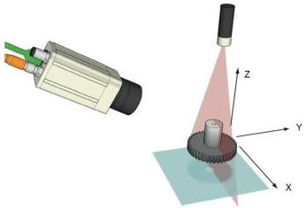

|  GEN<i>CAM |   | emva  |
| --- | --- | --- |
|  Version 2.7.1 | Standard Features Naming Convention  |   |

Note that in the scenario illustrated here and in the following examples, a Linescan 3D device is assumed. It is used to extract the range and reflectance of an object where a Laser line is projected. The object moves on a conveyor along the Y axis. With such a setup, during the scan of the object, each acquired 2D sensor image processed by the 3D Extraction module generates only one line of the 3D Range and Reflectance resulting frames. Therefore, Height (B) sensor images must be acquired before the full Range and Reflectance frames are complete.

Figure 21-20: Typical Linescan 3D acquisition setup.

In general in an image acquisition device, the Height feature represents the number of lines in each output image. For Linescan cameras this features is then not related to the sensor size but represents how many scan lines to include in each virtual frame generated. With 3D image extraction, there are use cases like for Linescan 3D device where an Areascan sensor is used in modes where the 3D scan processing result is similar to a regular Linescan sensor's device. In such Linescan 3D device, for each frame acquired by the sensor, the 3D extraction processing module will generate only one line of the resulting 3D image. So in those cases, the user needs to control individually the Height of the 2D sensor's Region to analyse and the Height of the resulting 3D processed buffer to transmit on the output stream.

To make possible to control both Height values independently using the existing Height feature, a combination of a sensor Region and dedicated 3D Scan Extraction processing module Region selectors can be used. The processing module Regions are optional formatters located at the output of the processing modules and that permit to control the dimensions and pixel format of the resulting image components.

In general, for a Region to deliver data to an output stream, its RegionMode must be On and at least one component must be active. So with a combination of sensor's Region, processing module Region and the component selectors, it is possible to stream out selectively the raw sensor data or the processed data output (or even both of them at the same time in certain cases).