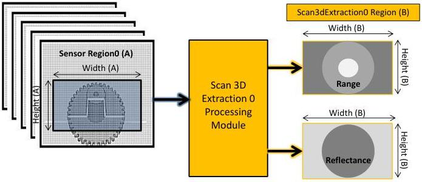

|  GEN<i>CAM |   | emva  |
| --- | --- | --- |
|  Version 2.7.1 | Standard Features Naming Convention  |   |

### 21.3.1 3D Devices configuration use cases

The use cases below show different ways a Linescan 3D camera can be configured to output the 3D profile data, the image sensor raw data or both at the same time (See Figure 21-20 for the assumed setup).

Note that in a real 3D acquisition device, most of the feature configuration presented below can be done automatically by changing only the DeviceScanType feature from 3D to 2D. It is also highly recommended that, as far as possible, a read of Height feature without changing the region selector explicitly returns the height of the transmitted buffer.

In the followings examples, the state of the features after each example is used as the basis for the next one.

#### 21.3.1.1 Linescan 3D Range and Reflectance output

In this use case, the Area sensor's Region0 defines the acquired sensor image dimension and is used as source to the Scan 3D Extraction processing module. A separate Scan3DExtraction0 processing module Region (B) is used to define independently the size of the result of the 3D laser line extraction to output.

Linescan 3D device Range and Reflectance output:

Figure 21-21: Linescan 3D Range and Reflectance components output.