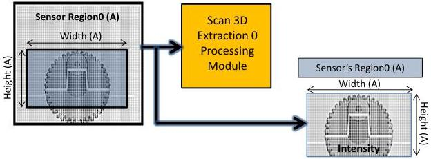

|  GEN<i>CAM |   | emva  |
| --- | --- | --- |
|  Version 2.7.1 | Standard Features Naming Convention  |   |

### 21.3.1.2 Linescan 3D sensor's Intensity output

Here the Intensity of the Area sensor's Region0 is streamed out. The Region0 (A) is used directly as 2D Intensity data source to stream out and the Scan 3D Extraction processing module output is disabled.

Linescan 3D device sensor Intensity output:

Figure 21-22: Linescan 3D sensor Intensity components output.

// 2. DeviceScanType = Areascan
// Switch to sensor 2D image output mode (Sensor Intensity out).
// ---
// Dataflow: Region0 -> Stream0

// Enable Region0 Intensity output.
RegionSelector = Region0;
ComponentSelector = Intensity;
ComponentEnable[Region0][Intensity] = True;

// Disable Scan3dExtraction0 3D output (Range and Reflectance).
RegionSelector = Scan3dExtraction0;
RegionMode[Scan3dExtraction0] = Off; // Disable the Region output.

// Start and eventually Stop acquisition.
AquisitionStart;
...
// Stop acquisition.
AquisitionStop;