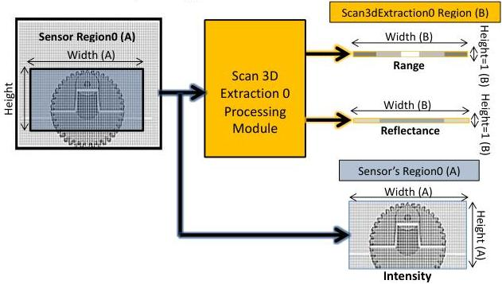

|  GEN<i>CAM |   | emva  |
| --- | --- | --- |
|  Version 2.7.1 | Standard Features Naming Convention  |   |

### 21.3.1.3 Linescan 3D Hybrid Range, Reflectance and Intensity output

Here we still stream out simultaneously the raw sensor 2D Intensity of the Region0 and the Scan 3D Extraction module resulting Range and Reflectance components. This "hybrid" mode makes tuning of the device parameters easier since both the image and its resulting extracted 3D profile can be visualized together. Note that since each 2D frame acquired by the sensor Region0 (A) only generates one line of 3D laser line extraction result (B), the Height of the Range and Reflectance components out must be set to 1.

Linescan 3D device Hybrid Range, Reflectance and Intensity output:

Figure 21-23: Linescan 3D Range ans Reflectance components output.

// 3. Configuration Hybrid mode (2D sensor image and 3D profile)
// ---
// Dataflow: Region0 -> Stream0
// Region0 -> Scan3dExtraction0 -> Stream0

// Sensor Intensity component output already enabled.
// Range and Reflectance components output already enabled.
// Set the 3D processing Region output size and enable it.
RegionSelector = Scan3dExtraction0;
Height[Scan3dExtraction0] = 1; // 3D Extraction output "frame Height" = 1.
RegionMode[Scan3dExtraction0] = On; // Enable the region Output.

// Start and eventually Stop acquisition.
AquisitionStart;
--
AquisitionStop;