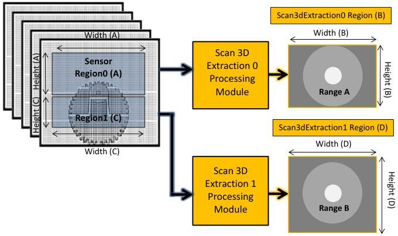

|  GEN<i>CAM |   | emva  |
| --- | --- | --- |
|  Version 2.7.1 | Standard Features Naming Convention  |   |

### 21.3.1.4 Linescan 3D Range output from 2 sensor regions

We will then do 2 simultaneous 3D Range extractions using 2 sensor Regions each sent to a separate Scan 3D Extraction processing module. Note that here, 2 separate laser lines are projected on the the scanned object. See Figure 21-9 for an example of such a setup.

Linescan 3D device with dual Range

Figure 21-24: Linescan 3D with dual Range components output.

// Setup a 2 Regions to output 3D Range.
// ---
// Dataflow: Region0 -> Scan3dExtraction0 -> Stream0.
// Region1 -> Scan3dExtraction1 -> Stream0.

// Set Region0 position and size.
RegionSelector = Region0; // First Sensor Region.
OffsetX[Region0] = 80; // Position of Region on sensor.
OffsetY[Region0] = 80; // Position of Region on sensor.
Width[Region0] = 800; // Number of rows of the sensor to read.
Height[Region0] = 400; // Number of lines of the sensor to read.
RegionMode[Region0] = On; // Region 0 features (Width, Height, ...) active.

// Disable Sensor's Region0 Intensity component output.
ComponentSelector = Intensity;