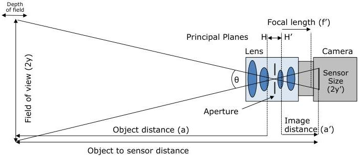

## 23 Optic Control

The Optic Control chapter describes the model and features related to the control of Optical components inside or attached to machine vision cameras.

These features can be applied to dedicated optical controller or to cameras with integrated optical control features. The target components covered by the optical features include, but not be limited to: Lenses, Filters, Filter Wheels, Shutter.

### 23.1 Basic Parameters of an Imaging Optical System

Imaging systems can incorporate a huge variety of optical components such as Lenses, Filters, Filter Wheels, Shutters, Apertures, etc. depending on the applications they are designed for. The most simple optical systems consist of an imaging device and a lens. The following figure shows the relationship of commonly used terms in optical systems.

Figure 23-1: Basic Schematic of an Imaging Optical System