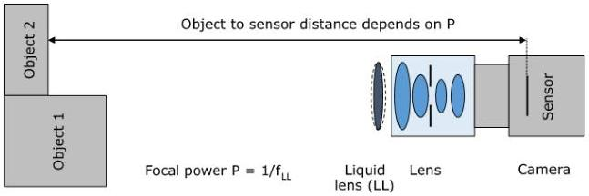

|  GEN<i>CAM |   | emva  |
| --- | --- | --- |
|  Version 2.7.1 | Standard Features Naming Convention  |   |

The Object to Sensor Distance (OSD) specifies the distance from the image sensor surface to the object (OSD=a+a'+HH').

The Object distance (a) is the distance from the principal plane H to the object.

The Image distance (a') is the distance from the principal plane H' to the sensor.

In combination with the Sensor Size (2y'), the Image distance (a') defines the angular field of view θ of an imaging system. In combination with the Object distance (a), the Field of View (FOV) on the object under inspection with negligence the principal plane distance can be approximated by FOV = 2y' * a / a'. So the shorter the image distance, the larger the field of view.

The Depth of Field (DOF) is the maximum object depth that can be maintained entirely in acceptable focus and thus is also the amount of object movement allowable while maintaining focus. The smaller the aperture, the greater the depth of field.

The Focal Length (f') of an optical system is the distance from the principal plane H' of a lens to its focal point (the point at which light rays that come from the infinite are bundled in a single point) and a measure of how strongly the system converges or diverges light. A lens with an adjustable focal length (e.g. focal length range from 24 – 105mm) is a Zoom lens.

Figure 23-2: Imaging Optical System with a liquid lens.

A Liquid Lens (LL) is an optical component which varies its Focal Power (P) in response to an electrical signal. Note that the liquid lens can generally be positioned in front or behind as well as inside imaging lenses.

The Focal Power (P = 1/fLL) – defined for singlet lenses as the reciprocal of the focal length and measured in diopters (abbr. dpt.) – indicates “how much” a liquid lens focuses. In an imaging system that comprises a liquid lens, the focal power of the liquid lens will determine mainly at what distance the object is in focus. Note that the focal length of the liquid lens itself must not be confused with the focal length of the imaging lens (which defines the field of view).