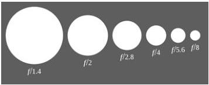

|  GEN<i>CAM |   | emva  |
| --- | --- | --- |
|  Version 2.7.1 | Standard Features Naming Convention  |   |

The Optical Magnification (β') of a lens is defined as the ratio between the sensor size (2y') and the Field of view (2y), so it is the ratio between the apparent size of an image and its true size. Thus it is a dimensionless number and normally mathematically negative, because a real image through a lens is upside down.

Colloquially the minus will be ignored.

For an object distance (a) of infinity the focal length (f') is equal to the image distance (a') and the optical magnification β' is equal to zero.

The Aperture stop (also called iris, f-number, f-stop or f/#) of a lens can be adjusted to control the amount of light reaching the image sensor and is the ratio of the focal length (f') of the lens to the diameter of the entrance pupil (D_EP).

$$f / \# = \frac {f ^ {\prime}}{D _ {E P}}$$

The numbers usually increase by multiples of √2. Increasing the f/# by a factor of √2 will halve the area of the aperture, effectively decreasing the light throughput of the lens by a factor of 2. Lenses with lower f/# are considered fast and allow more light to pass through the system, while lenses of higher f/# are considered slow and feature reduced light throughput. Higher f/# allow for larger depth of field but might introduce resolution losses due to diffraction.

Figure 23-3: Representation of standard aperture sizes

The entrance pupil is the optical image of the physical aperture stop through the single lenses in front of the iris and defines the light intensity of a lens system. The exit pupil is the optical image of the aperture stop through the single lenses after the iris.

The Numerical Aperture (NA), which instead of the angular aperture expressed as f/# is used in areas of optics such as microscopy, is defined as the sine of the marginal ray angle in image space. The larger the NA, the more light is captured by the lens, the higher the resolution of the system (i.e. the lower the diffraction limit) and the smaller the depth of field. The NA is inversely proportional to f/#.

### 23.2 Optic Control features usage model