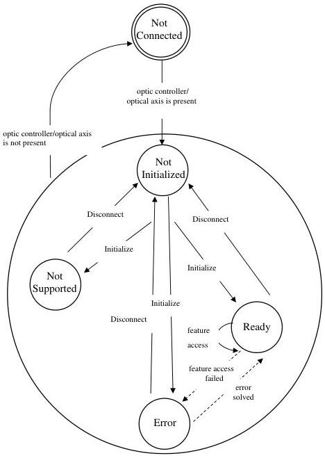

|  GEN<ì>CAM |   | emva  |
| --- | --- | --- |
|  Version 2.7.1 | Standard Features Naming Convention  |   |

### 23.3 Status of optic features state machine

The following state machine can be applied to all status features. This includes the global status of the optic controller as well as the status of the single optical axes.

