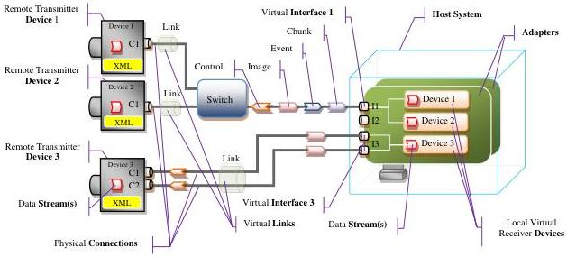

|  GEN<i>CAM |   | emva  |
| --- | --- | --- |
|  Version 2.7.1 | Standard Features Naming Convention  |   |

|   | is bidirectional and initiated by the Host System.  |
| --- | --- |
|  Event | An asynchronous notification of the occurrence of a fact. Events are transmitted on an Event Channel.  |

## 1.5 Device Communication Model

This section presents the general communication model for the devices controlled using the SFNC. It presents the main elements involved in the communication for control and data streaming between the Host System and the acquisition Device.

Figure 1-1: Device Communication Model

In general, the Device Communication model is:

The remote Device and the Host System communicate using a virtual Link.

The virtual Link is established on an Interface using one or more physical Connections.

The Host System controls the remote Device using the features present in its GenICam XML file.

The remote Transmitter Device has a data Source that generates a data Stream.

The data Stream is sent to the Host System on a Stream Channel of the virtual Link.

The reception of the data Stream on a Host Interface is handled by a local receiver Device.

The local receiver Device writes the data Stream to the Host System memory.

See section 1.4 Standard Definitions section above for more detailed information.

## 1.6 Device Acquisition Model

This section presents the general data acquisition model for the devices controlled using the SFNC. It