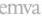

|   GEN<ì>CAM |   |  emva  |
| --- | --- | --- |
|  Version 2.7.1 | Standard Features Naming Convention  |   |

|  Level | Optional  |
| --- | --- |
|  Interface | IFloat  |
|  Access | Read/Write  |
|  Unit | -  |
|  Visibility | Beginner  |
|  Values | >0  |

Sets the aperture (also called iris, f-number, f-stop or f/#) of the lens. The lower the f/# the more light goes through the lens (the “faster” the lens) and the smaller the depth of field.

23.4.17 ApertureStepper

|  Name | ApertureStepper[OpticControllerSelector]  |
| --- | --- |
|  Category | OpticControl  |
|  Level | Optional  |
|  Interface | IInteger  |
|  Access | Read/Write  |
|  Unit | -  |
|  Visibility | Expert  |
|  Values | ≥0  |

ApertureStepper controls the stepper value of the aperture. 0 is the maximum opening.

23.4.18 NumericalAperture

|  Name | NumericalAperture[OpticControllerSelector]  |
| --- | --- |
|  Category | OpticControl  |
|  Level | Optional  |
|  Interface | IFloat  |
|  Access | Read/Write  |
|  Unit | -  |
|  Visibility | Beginner  |
|  Values | >0  |