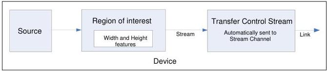

|  GEN<i>CAM |   | emva  |
| --- | --- | --- |
|  Version 2.7.1 | Standard Features Naming Convention  |   |

presents the main elements involved in the data acquisition by a Device and the typical data flow for transfer of images to the Host System. It covers the typical devices with a single data source and the more complex devices with multi-source, multi-region of interest and data transfer control.

Basic acquisition Devices with one source of data, one region of interest and automatic control of the transfer of data such as the one shown in Figure 1-2, are simple particular case of this model where the Source, Region and Transfer features are fixed and cannot be changed (so the corresponding fixed features can be omitted).

Figure 1-2: Basic acquisition device with fixed configuration.

The typical features setting for such a basic device where the values of Source, Region and Transfer Control Stream are fixed is typically reduced to:

Width = 320

Height = 240

AcquisitionStart

...

AcquisitionStop

But in general, for more complex devices, the acquisition and data transfer model is:

A Device has one or many Source(s).

A Source has one or many Region(s) of interest.

A Region of interest goes to a data Stream.

The data generation by the Source is controlled by the "Acquisition Control" features.

The dimensions of a Region of interest are controlled by the "Image Format Control" features.

The outgoing data flow of a Stream is controlled by a "Transfer Control" features.

The output of the Transfer Control module goes to a Stream Channel.

The Stream Channel is transmitted on a virtual Link.

The virtual Link is established with a Host System using one or many Device's physical Connection(s).

Figure 1-3 below presents an example of a more complex device supporting multi-source, multi-region with data stream transfer control.