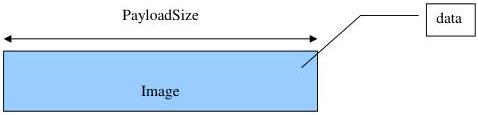
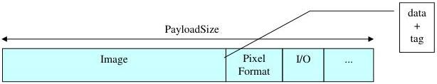

|  GEN<ì>CAM |   | emva  |
| --- | --- | --- |
|  Version 2.7.1 | Standard Features Naming Convention  |   |

## 24 Chunk Data Control

Chunks are tagged blocks of data. The tags allow a chunk parser to dissect the data payload into its elements and to identify the content.

The length of the chunk data section varies depending on the number of activated chunks, but the receiver can always expect the chunk data section to fit within the maximum size of PayloadSize.

# **Regular Chunk data mapping:**

Typically, with chunks disabled (ChunkModeActive = False) the device streams frame data consisting only of the image.

Figure 24-1: Frame with chunks disabled.

and with chunks enabled (ChunkModeActive = True) the device streams frame data consisting of chunks. In this case the image data can also be a chunk.

Figure 24-2: Frame with chunks enabled.

Each chunk can be enabled or disabled using the ChunkSelector and ChunkEnable feature. This allows controlling the embedding of different information in the payload.

The data in the chunks is exposed and extracted via a chunk parser that uses the device's XML to interpret the chunk data.

In the XML, the naming scheme to access the data of the chunk associated with a feature Name is ChunkName and any SFNC feature can have a chunk counterpart when this applies.