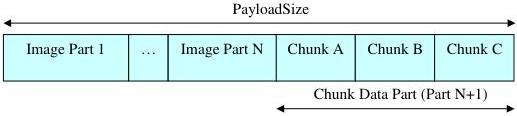

|  GEN<ì>CAM |   | emva  |
| --- | --- | --- |
|  Version 2.7.1 | Standard Features Naming Convention  |   |

Note that sometimes it might be necessary to process the chunk data without access to the device that generated it and its associated GenICam XML file. In that case, the ChunkXMLEnable feature can be used to include into the payload the XML logic needed to decode the chunk data. This makes the payload buffer completely self-describing.

## Multi-Component Chunk data mapping:

A multi-component payload includes multiple data sections where each component maps to one or many data parts.

For multi-component/multi-part payload transmitted on a single stream channel, all the image data parts generally come before the chunk data part that is transmitted last.

Figure 24-3: Illustration of multi-component/multi-part data and chunks.

## Selectors in Chunks

The Chunk Data Control defines a number of selectors that are available to access a particular item of a Chunk received. These selectors are not part of the transmitted chunk data, but are included in the device XML and can be used by the receiver to index the transmitted chunk data. Note that in the Chunk Data feature descriptions below it is not explicitly stated for all chunks whether they can be dependent on one or more selector, this information is device dependent and found in the XML for each selector.

These Chunk Data selectors include ChunkComponentSelector and ChunkScanLineSelector discussed in detail below, as well as other selectors such as the 3D specific chunk data.

A device potentially has multiple sources, where each source can have multiple regions and each region multiple components. A single multi-component transfer contains data which from the system perspective, belongs together and form a group that is expected to be processed together. This does not mean however that the chunk data is common to all Components.

Some chunk data can be applicable to Sources (possibly different sensor size), Regions (different image region size and offset and 3D configuration) or Components (different dynamic range and pixel formats).

Using these selectors, it is possible to read and map the chunk data to the individual Source, Region and Components it pertains.

For example to receive the Pixel Format information for each component of a 2 components payload with chunk data and read it at the reception, the code could be:

Device side: