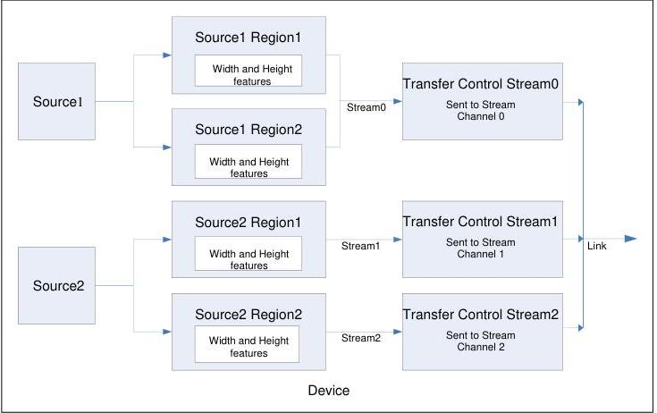

Figure 1-3: Multi-source, multi-region acquisition device with data stream transfer control.

The typical feature setting model for such a complex multi-source device is presented in detail the chapter 19 (Source Control). The features for the control of the regions of interest and image format handling are documented in chapter 4 (Image Format Control) and chapter 20 (Transfer Control) presents the features to control the flow of data on the external link.